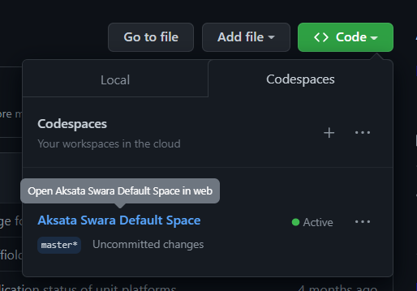
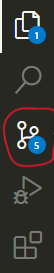
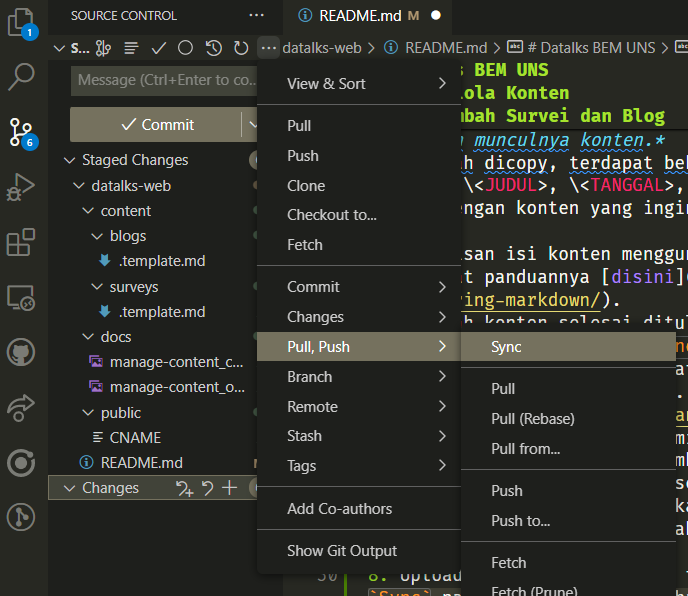

# Datalks BEM UNS

Platform survey dan data dibawah naungan Kementrian Riset dan Data BEM UNS.

## Mengelola Konten

### Persiapan
- Akun GitHub

#### Menggunakan Codespaces
1. Setelah mendapat akses ke projek GitHub langkah selanjutnya adalah masuk ke Codespaces.
2.  Pada halaman [repositori](./), klik tombol `Code` dan pilih `Open with Codespaces`. Dari pilihan yang ada pilih `Default Space`.
   
3. Pastikan telah masuk ke Codespaces dengan melihat tanda `Codespaces` pada bagian kiri atas halaman.
4. Pastikan juga telah menggunakan akun yang benar dengan melihat nama user dibagian bawah kiri pada icon account.

### Menambah Survei dan Blog
1. Pada panel bagian kiri terdapat folder `content/surveys` atau `content/blogs`. Pilih salah satu folder sesuai dengan jenis konten yang ingin ditambahkan.
2. Copy file `.template.md` untuk membuat konten baru. Kemudian beri nama file tersebut dengan format `YYYY-MM-DD-nama-konten.md` (misal: `2021-01-01-contoh-survei.md`).

   *Aturan penamaan file ini hanyalah saran dari kami. Silakan gunakan nama file bebas. Nama file ini juga akan memengaruhi urutan munculnya konten.*
3. Setelah dicopy, terdapat beberapa bagian yang dapat diubah (contoh: \<JUDUL>, \<TANGGAL>, YYYY-MM-DD, dll.). Silakan ubah sesuai dengan konten yang ingin ditambahkan.

   Penulisan isi konten menggunakan aturan markdown dimana dapat dilihat panduannya [disini](https://guides.github.com/features/mastering-markdown/).
4. Setelah konten selesai ditulis, simpan perubahan dengan menekan tombol `Ctrl + S` atau `Command + S` pada keyboard.
5. Commit perubahan yang dibuat melalui tombol `Source Control` pada bagian kiri atas halaman.
   
6. Pilih file yang akan dicommit dengan menekan tombol `+` pada bagian kiri file tersebut (Tombol `+` pada file akan muncul ketika cursor berada diatas file tersebut).
7. Pada input `Message` tuliskan pesan yang menjelaskan perubahan yang dibuat (Opsional). Setelah itu tekan tombol `Ctrl + Enter` untuk melakukan commit.
8. Upload/Push pembaruan yang telah dibuat dengan menekan tombol `Sync` pada bagian kiri atas halaman.
   
9. Setelah pembaruan berhasil diupload, tunggu beberapa saat. Konten baru akan muncul pada Web.
10. Congrats! 🎉

### Mengubah Survei dan Blog
Untuk mengubah konten dapat langsung dengan mengubah filenya langsung, setelah file disimpan lakukan commit dan push seperti pada langkah sebelumnya (Langkah ke-5 – 10).

### Menghapus Survei dan Blog
Langsung saja hapus filenya, setelah file disimpan lakukan commit dan push seperti pada langkah sebelumnya (Langkah ke-5 – 10).
